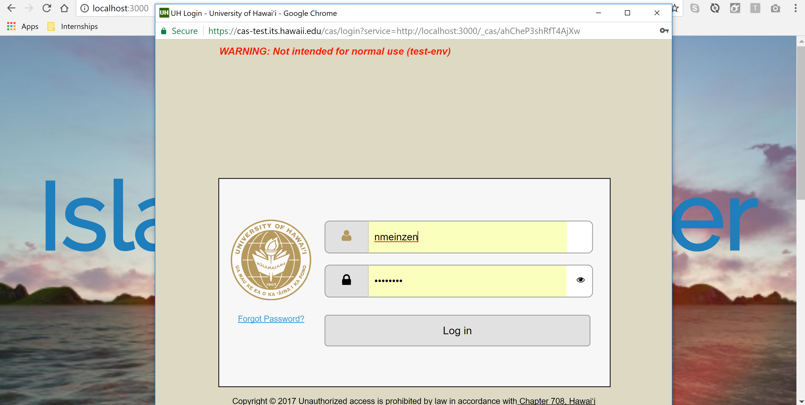
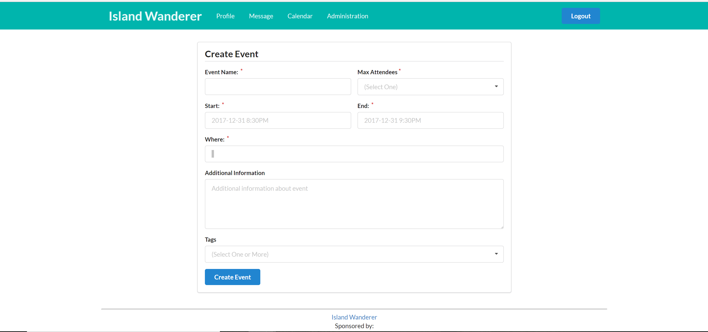
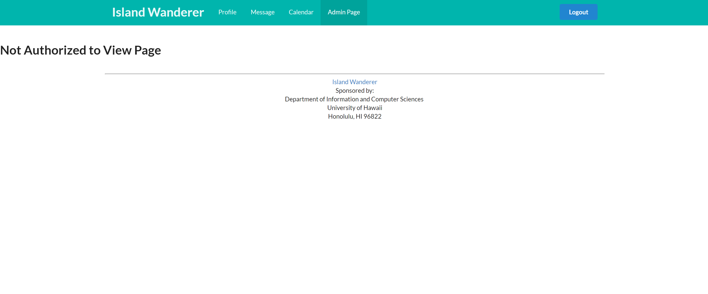

<h1 id="top">Table of Contents</h1>
<h4><a href="#overview">Overview</a></h4>
<h4><a href="#userguide">User Guide</a></h4>
<ul>
 <li><a href="#landing">Landing Page</a></li>
 <li><a href="#profile">Profile Page</a></li>
 <li><a href="#home">Home Page</a></li>
  <li><a href="#createEvent">Create Event Page</a></li>
 <li><a href="#calendar">Calendar Page</a></li>
 <li><a href="#message">Message Page</a></li>
 <li><a href="#admin">Admininistrative Page</a></li>
 
</ul>
<h4><a href="#developerguide">Development</a></h4>
<ul>
 <li><a href="#history">Development History</a></li>
 <ul>
  <li><a href="#m1">Milestone 1</a></li>
  <li><a href="#m2">Milestone 2</a></li>
 </ul>
 <li><a href="#guide">Developer Guide</a></li>
 <ul>
  <li><a href="#install">Installation</a></li>
  <li><a href="#modify">Modification</a></li>
 </ul>
</ul>
<h4><a href="#feedback">Community Feedback</a></h4>

<h2 id="overview">Overview</h2>

<a href="https://github.com/islandwanderer/islandwanderer">Island Wanderer</a> is the perfect website for University of Hawaii students who want to explore the islands of Hawaii with other students. The Hawaiian Islands have a lot to offer, from hiking to snorkeling to luaus to relaxing at the beach. However, sometimes it can be hard to organize a group of people to go explore these places. Island Wanderer is here to solve this problem. Students can form groups to go on adventures together, creating countless unforgettable memories while meeting new people along the way.

 

The developers of this website are current University of Hawaii students who are passionate about exploring the Hawaiian Islands and love to connect with people through adventuring. If you have any comments or questions, you can contact the developers through creating an issue on the GitHub site.

<a href="#top">Back to top</a>

<h2 id="userguide">User Guide</h2>

Students are able to log into the website and are immediately taken to the home page, which shows postings from other students, starting with the most recent posting. Users can then filter the postings by tags - locations, dates, people, etc. Students will have the option to save posts, message the poster, or post something themselves. They can also comment on a post. Students will also have access to a personal calendar, which will hold all the events the student wants to attend. Two ways to add events to the calendar is through manually entering an event, or directly addiing an event from a post. Furthermore, students can start private messages with other students, should they have any specific questions about a post or activity. Because students don't have to "friend" other students to see their posts/directly message them, there will be the option to block certain students, should there be any issues. 

<a href="#top">Back to top</a>

<h4 id="landing">Landing Page</h4>
The landing page of the website has a small bit of information about the website and allows UH students to log in. 

 

Once students click the log in button, they are immediately prompted to log into the University of Hawaii System to verify their status as a student.

 

<h4 id="profile">Profile Page</h4>

Once logged in, students are immediately taken to their profile page where they can enter their information. Students must enter their name and their email address. They can add other contact info such as facebook, slack, twitter, etc. to their account if they would like.

 

<h4 id="home">Home Page</h4>

Next students can go to their home page. Students can search for specific events or events with key words, which will show all new events containing that information. If they are interested, they can join an event.

 

<h4 id="createEvent">Create Event Page</h4>

Also linked to the home pages are the add event page and report event page. If a student would like to organize and event, the can click the button to add a new event. 

 

Or report an event/user.

 

<h4 id="calendar">Calendar Page</h4>

Next, students can check their personal calendar. If the student chooses to attend an event, it will show up on their calendar.

 

<h4 id="message">Message Page</h4>

Finally, students can then check their messages, which will show all messages from groups they are apart of.

 

<h4 id="admin">Administrative Page</h4>

There is also an administrative page. Only the developers have access to this page. If the user signed is has also been assigned the role 'admin', they will be able to view this page, which will show any events that have been flagged. The administrator has access to delete, modify, or leave the event alone. 

 

If the user logged in does not have administrative access, the page will show up as 'Not Authorized'.

 

<a href="#top">Back to top</a>

<h2 id="developerguide">Development</h2>
<h4 id="history">Development History</h4>

In order to successfully create a working application, the building process was split into multiple tasks. The first task, Milestone 1, focused on building the foundation for the application. The second task, Milestone 2, focused on refining the foundation and increasing its functionality. Below document each task.

<h5 id="m1">Milestone 1</h5>

<a href="https://github.com/islandwanderer/islandwanderer/projects/1">Milestone 1's</a> purpose was to create HTML/CSS mockups of each of the pages needed for the projects. They did not have to provide functionality, but had to be integrated into the Meteor app. Below are screenshots of the pages implemented.

 
 
 
 

Each page was assigned as an issue and was either branched and merged into the master branch, or directly committed into the master branch.

                                                                    
<h5 id="m2">Milestone 2</h5>
<a href="https://github.com/islandwanderer/islandwanderer/projects/2">Milestone 2's</a> purpose was to provide functionality to the mockup pages created in Milestone 1. Once each page was completed and functionality had been tested, the app was deployed to <a href="https://galaxy.meteor.com/app/islandwanderer.meteorapp.com">galaxy</a>. See <a href="#userguide">User Guide</a> for instructions on app usage.

<a href="#top">Back to top</a>

<h4 id="guide">Developer Guide</h4>
<h5 id="install">Installation</h5>
In order to run Island Wanderer, <a href="https://www.meteor.com/install">Meteor</a> needs to be installed. Once this process is finished, the user must download or clone a copy of <a href="https://github.com/islandwanderer/islandwanderer">Island Wanderer</a> and cd into the app. Once the user is inside of the app, the user must install npm by running $ meteor npm install. Finally, once npm is correctly installed, the user can run the system by typing $ meteoer npm run start in the commmand promt and the app should appear on http://localhost:3000 if everything has been installed correctly.

<h5 id="modify">Modification</h5>

Island Wanderer's <a href="https://github.com/islandwanderer/islandwanderer">basic structure</a> is split into three categories: app, which holds the actual application, config, which configurates all the files, and .gitignore. For modificatation, most work will be done in the app directory. Within app, there are <a href="https://github.com/islandwanderer/islandwanderer/tree/master/app">two subsections</a>: client, which holds all information pertaining to the client side of the application, and imports. Most modification will be done in imports. Depending on what modification needs to be done depends on which subfolder the developer will need to access. If the developer is interested in adding another page to the application or altering one of the existing pages, they will need to cd into the ui section and acess the pages category. This will give them access to all html/css/js code for the existing pages. If the developer would like to edit the startup of the app, they will need to access the api folder and choose startup, and decide if they would like to edit the server side of the startup, the client side, or both. The entire system follows the Meteor 1.4 guidelines.If the developer adds or deletes any pages, they will need to also edit the client/main.js page in order to maintain working order. The developer may also need to edit the router page, which is responsible for the navigation throughout the app. The router page can be found in the <a href="https://github.com/islandwanderer/islandwanderer/blob/master/app/imports/startup/client/router.js">imports/startup/client/router.js</a> directory and uses <a href="https://github.com/kadirahq/flow-router">Flow Router</a>.

Island Wanderer uses <a href="https://github.com/Semantic-Org/Semantic-UI-Meteor">Semantic-UI-Meteor</a> for the webpage presentation. It is integrated in the <a href="https://github.com/islandwanderer/islandwanderer/tree/master/app/client/lib/semantic-ui">app/client/lib/semantic-ui</a> directory, and any edits to the presentation of the app can be made there.

Finally, in order to guarantee correct startup and code quality, Island Wanderer contains a <a href="https://github.com/islandwanderer/islandwanderer/tree/master/config">configuration file</a>, which holds the settings files. Furthermore, there is a directory, <a href="https://github.com/islandwanderer/islandwanderer/blob/master/.gitignore">.gitignore</a>, that allows developers to add settings that will not be committed. There is also a directory for <a href="https://github.com/islandwanderer/islandwanderer/blob/master/app/imports/startup/server/initialize-database.js">initialization</a>, which checks for empty databases and loads correct configuration files. These configuration tools, as well as all code provided for functionality, are checked for quality assurance by using ESLint, which is defined in the <a hrefe="https://github.com/islandwanderer/islandwanderer/blob/master/app/.eslintrc">.eslintrc</a> file.

<a href="#top">Back to top</a>

<h2 id="feedback">Community Feedback</h2>

Because Island Wanderer is a user oriented app, community feedback is extremely important for the continual improvement of the app. Thereofore, five University of Hawaii students were asked to examine the app and provide constuctive criticism on what they liked about the app and what could be improved. All five students agreed they liked the simplicity of the layout. They appreciated having one top menu that gave access to every page within the app on every page, meaning they could jump from page to page without having to go back to the home page. Furthermore, they liked the ease of access to events and searching mechanisms. It was simple to search for what they were interested in as well as customize their own individual event. They also provided a few insights as to how to improve the app. They suggested adding more functionality to the calendar by letting users add events directly to a date instead of having to add an event through the home page. They also suggested that the administrated be given more power to search specific users or events, instead of waiting for a flag. Overall, the users liked the app and think it would be a great addition to the UH community. 

<a href="#top">Back to top</a>

